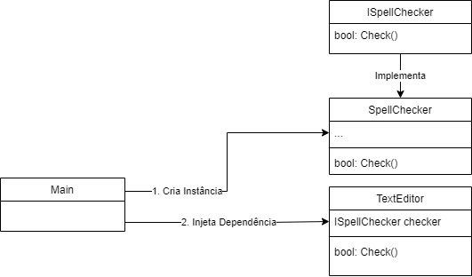

# Injeção de dependência e inversão de controle

## Dependência

Uma dependência é quando uma classe depende de outra para realizar uma função, de forma a utilizar um recurso. Digamos que em uma aplicação que possui um componente de edição de textos, você quer adicionar a funcionalidade de verificação ortográfica, por exemplo:


No diagrama acima, o `SpellChecker` é uma dependência de `TextEditor`. A **classe TextEditor está dependendo diretamente de `SpellCHecker`**, tendo a responsabilidade de instânciar e chamar a outra classe.

Isso permite a reutilização dessa funcionalidade por outras classes, porém gera um acoplamento forte entre as classes, sendo representado no código abaixo:

```c#
public class TextEditor {
    private SpellChecker checker;

    public TextEditor() {
        this.checker = new SpellChecker();
    }
}
```

## Inversão de controle

Inversão de controle é o processo de transferir o controle de uma função para outro serviço, como um framework. Assim, conseguimos focar na escrita do código para tomar ação a partir da declaração de quando tomar uma ação, e não como realizar essa ação.

Um exemplo é o `[HttpGet]` do .NET, sendo uma inversão de controle responsável por lidar com uma chamada GET de uma API. Nesse caso, não precisamos nos preocupar em implementar essa funcionalidade, transferindo a responsabilidade para o framework e nos focando apenas no que fazer após receber a chamada.

## Orientação a interfaces

No primeiro exemplo, é gerado diversos problemas devido ao acoplamento a uma classe concreta, como:

* Para substituir a classe `SpellChecker` com uma implementação diferente, é preciso alterar a classe TextEditor;
* Caso `SpellChecker` tenha outras dependências, elas precisam ser configuradas pela classe `TextEditor`. Isso resulta em um código de configuração espalhado caso várias classes do sistema utilizem o `SpellChecker`;
* Não é possível criar mocks para testes unitários, por depender da implementação de `SpellChecker`.

Para resolver parte do acoplamento, o primeiro passo para reduzir o acoplamento é através do design **orientado a interfaces**. Com uma classe orientada a interfaces, é possível a alteração de uma implementação sem que afeta a classe que utilize essa dependência.

Um segundo passo é transferir a responsabilidade de criar os objetos das dependências para quem utiliza a classe, tendo ela então a responsabilidade de injetar a dependência, não mais o `TextEditor`.



O diagrama acima mostra a utilização do TextEditor por uma outra classe (como a classe Main), tendo o controle sobre qual implentação da interface ISpellChecker utilizar, fornecendo-a antes de utilizar em si a TextEditor.

Adaptando o exemplo acima, a classe `TextEditor` deve depender da interface de SpellChecker, e não mais da implementação. Além disso, ela deve dar a responsabilidade de injetar a implementação para outra classe, nesse exemplo é utilizado a injeção via construtor:

```c#
public class TextEditor {
    private ISpellCHecker checker;

    public TextEditor(ISpellCHecker checker) {
        this.checker = checker;
    }
}
```

Já o código para utilização da classe (caso não utilizar um framework para ajudar):

```c#
ISpellChecker sc = new SpellChecker(); // Implementação de ISpellChecker
TextEditor textEditor = new TextEditor(sc);
bool textoOk = textEditor.Check();
```

### Tipos de injeção de dependência

Explicando de forma breve, existem 2 principais maneiras

1. Injeção via construtor

    > É o exemplo utilizado acima, onde para construir uma instância de `TextEditor`, é obrigado fornecer uma implementação de `ISpellChecker`

2. Injeção via Setter

    > Para esse caso, após instanciar a classe, a injeção é realizada via um método set, por exemplo:

```c#
public class TextEditor {
    private ISpellCHecker checker;

    public TextEditor() {
    }

    public SetTextEditor(ISpellCHecker checker) {
        this.checker = checker
    }
}
```

## Injeção de dependências

Conforme um sistema vai crescendo, a criação de vários objetos pode se tornar um processo complexo e trabalhoso. Uma maneira é tornar necessário apenas com que o componente solicite a dependência, e não mais o fornecimento por um componente. Isso é possível através da **injeção de dependência**.

A injeção de dependência (ou *dependency injection*) é uma *design pattern* para sistemas com orientação a objetos, sendo uma **especialização de inversão de controle tendo (IoC)** o objetivo de injetar dinamicamente dependências em uma classe, em tempo de execução. Nesse caso, a responsabilidade de construir os objetos para um framework.

### Service Container do ASP.NET Core

O ASP.NET Core possui um **container de serviços**, onde é possível registrar as dependências. O .NET ficará responsável por criar e eliminar instâncias da dependência onde for necessário. **É a partir dele que iremos aplicar a injeção de dependência**.

ele torna mais fácil a configuração de implementações, ao invés de levar a responsabilidade de fornecer manualmente a implementação para uma classe, antes de conseguir utiliza-la, o que pode ser um processo demorado.

No container de serviços, é qual implementação de cada interface utilizar. Dessa forma, quando uma nova instância é requisitada, ele automaticamente resolve as dependências.


### Ciclo de vida de uma dependência

Uma das principais vantagens da utilização de um container de IoC é o controle do ciclo de vida da instância da dependência, sem com que o desenvolvedor se preocupe em desenvolver essa lógica. 

A escolha do ciclo de vida é realizada na etapa do registro da implementação, sendo os ciclos disponíveis no C#:

* Singleton - Uma instância compartilhada por todas as requisições;
* Scoped - Uma instância por requisição;
* Transient - Uma instância por chamada, sendo sempre diferentes.

Transferindo para código, cada forma ficaria da seguinte maneira:

```c#
services.AddSingleton<IMyDependency, Myependency>() // Scoped
services.AddScoped<IMyDependency, Myependency>() // Scoped
services.AddTransient<IMyDependency, Myependency>() // Transient
```

Existem casos específicos de quando usar cada uma das implementações. Por exemplo, `Singleton` pode ser ideal para classes de `cache`, por ser acessadas em todas as requisições. Essas diferenças e seus casos de uso serão discutidos no próximo artigo.

## Fontes

<https://stackoverflow.com/questions/3058/what-is-inversion-of-control>

<https://learn.microsoft.com/en-us/aspnet/core/fundamentals/dependency-injection?view=aspnetcore-7.0>

<https://stackoverflow.com/tags/dependency-injection/info>

<https://stackoverflow.com/questions/130794/what-is-dependency-injection>

<https://stackoverflow.com/questions/4596300/where-exactly-is-the-difference-between-ioc-and-di>

<https://learn.microsoft.com/en-us/previous-versions/msp-n-p/ff921087(v=pandp.10)>
<https://imasters.com.br/software/inversao-de-controle-service-locator-e-injecao-de-dependencia>

<https://reflectoring.io/dependency-injection-and-inversion-of-control/>
